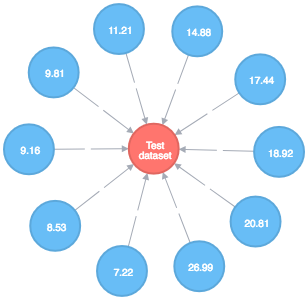
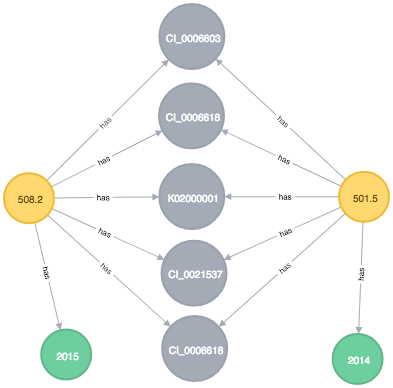

## Neo4j notes

### Installation / getting started

If you are new to Neo4j a good place to start is getting it installed and navigating to the browser based interface at http://localhost:7474/browser/.
There are a number of examples and guides in here to explore.

There is also good developer docs online: http://neo4j.com/docs/developer-manual/current/
A free PDF ebook is available: http://info.neo4j.com/rs/neotechnology/images/Graph_Databases_2e_Neo4j.pdf

#### Run Install Neo4j via brew

```
brew install neo4j
```

edit /usr/local/Cellar/neo4j/3.2.0/libexec/conf/neo4j.conf
 - dbms.security.auth_enabled=false
 - dbms.security.allow_csv_import_from_file_urls=true

#### Run Neo4j in Docker
Docker related docs: https://neo4j.com/developer/docker/

Docker: https://hub.docker.com/_/neo4j/

```
docker run --rm \
    --publish=7474:7474 --publish=7687:7687 \
    --volume=$HOME/neo4j/data:/data \
    --env=NEO4J_AUTH=none \
    --env=NEO4J_dbms_memory_pagecache_size=1G \
    --env=NEO4J_dbms_memory_heap_maxSize=512M \
    --name neo neo4j:3.2.1
```
( change memory related environment variables as required )

Navigate to http://localhost:7474/browser/ to use the browser based interface.

#### Import data via the cypher console

When importing CSV files using the CSV importer (http://neo4j.com/docs/developer-manual/current/cypher/clauses/load-csv/), the files are expected to be in the `/usr/local/Cellar/neo4j/3.2.0/libexec/import`

Execute a cypher script using the cypher-shell: `cat Constraints.cypher | cypher-shell --format plain`

#### Run the importer (note the code for the importer is an old model that has been superseded and is loaded via cypher console)

- cd import
- unzip the file you want to import in the ../input-files directory
- `go build`
- `./import ../../input-files/{filename}`

#### Run the query app

This is a Golang app that runs a query against Neo4j and iterates the results to print a count.
- cd query
- `go build`
- `./query --q "MATCH ..."`

### Common queries

Remove all nodes from the DB: `MATCH (n) DETACH DELETE n`
Count all nodes `MATCH (n) RETURN count(n)`

### Go client / driver
 - https://neo4j.com/developer/go/

Bolt - https://github.com/johnnadratowski/golang-neo4j-bolt-driver
    - uses binary bolt protocol which is more performant
    - no obvious way to batch create = slow batch inserting
    - not officially supported
    - not well documented
CQ (not evaluated) - https://github.com/go-cq/cq
    - Does not support the current version with bolt protocol

### Performance considerations
 - Does not have indexes in the traditional RDBMS sense.
 - Indexes exist in Neo4J, but are only used to find the initial node to start traversing the graph.
 - consider evaluating queries upfront and filtering by the dimensions with the highest cardinality first. 
   This will narrow down the results quicker and improve response times. 
   See https://maxdemarzi.com/2017/03/20/searching-for-objects-using-multiple-dimensions/
 
### Scalability considerations
https://neo4j.com/blog/neo4j-scalability-infographic/
 - Read perf cache based sharding - route different dataset requests to different nodes. : http://info.neo4j.com/rs/neotechnology/images/Understanding%20Neo4j%20Scalability(2).pdf
 - write perf - "Neo4j HA makes use of a single master to coordinate all write operations, and is thus limited to the write throughput of a single machine. Despite this, write throughput can still be very high." - use a queue to buffer write operations.
 - consider storing row data in another DB if the graph db becomes too large

### Modelling

##### Model 1 - encoding all dimension data on a single relationship for each observation.



This model has a single entity for the dataset and an entity for each observation. Each observation is linked to the dataset with a single relationship that contains all of the dimension / option data for that observation.

##### Model 2 - an entity for each dimension option, linking directly to the observations that are related to that option.



This model stores each dimension option as its own entity. The dimension is set as the entity type of each option entity. Each observation has its own entity and has a relation to all the options that it relates to.
